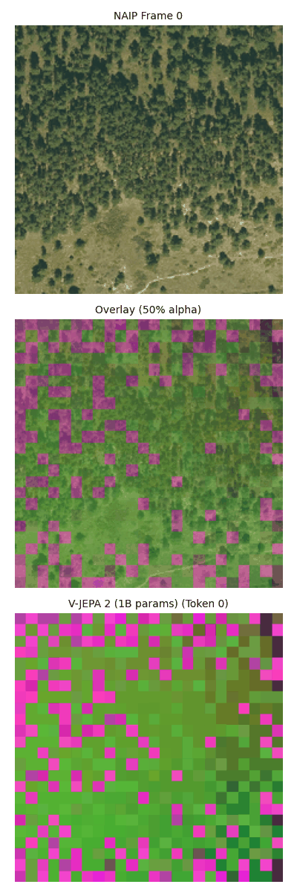
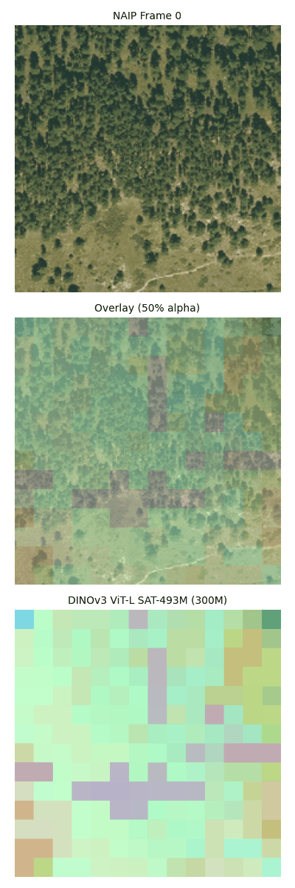
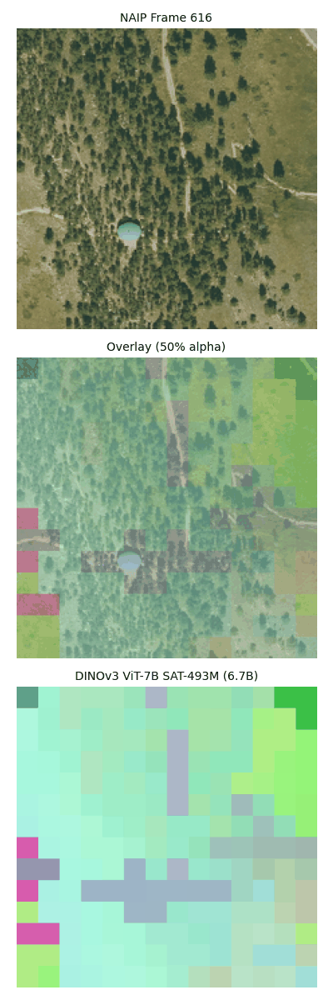

# Vision Encoders for Earth Observation

This module provides comprehensive infrastructure for extracting, processing, and visualizing visual embeddings using state-of-the-art self-supervised models: **V-JEPA 2** and **DINOv3**, optimized for Earth observation and biodiversity monitoring.

## Visual Comparison

<table>
<tr>
<td align="center"><b>V-JEPA 2 (1B params)</b></td>
<td align="center"><b>DINOv3 ViT-L (300M params)</b></td>
<td align="center"><b>DINOv3 ViT-7B (6.7B params)</b></td>
</tr>
<tr>
<td></td>
<td></td>
<td></td>
</tr>
<tr>
<td align="center">Temporal-aware video encoder</td>
<td align="center">Satellite-optimized (SAT-493M)</td>
<td align="center">Highest accuracy satellite model</td>
</tr>
</table>

*Comparison on NAIP aerial RGB imagery (sub-meter scale) with UMAP-reduced embeddings. Each model uses identical UMAP hyperparameters for fair comparison.*

## Overview

We provide two complementary vision encoders:

### V-JEPA 2 (Video Joint Embedding Predictive Architecture)
- State-of-the-art self-supervised video representation learning from Meta AI
- Learns spatiotemporal features without supervised training bias
- Processes images and video sequences to capture both spatial patterns and temporal dynamics
- Ideal for temporal analysis and change detection

### DINOv3 (Self-Distillation with No Labels)
- Meta AI's latest self-supervised vision transformer
- Satellite-specific models pretrained on SAT-493M dataset
- Optimized for Earth observation with models ranging from 300M to 6.7B parameters
- Superior performance on satellite imagery classification and segmentation

## Key Features

- **Sequential Frame Processing**: Process continuous video sequences with temporal coherence
- **Multi-scale Visualization**: UMAP and PCA dimensionality reduction for interpretable embeddings
- **Batch Processing**: Efficient processing of large-scale datasets with GPU optimization
- **End-to-End Pipeline**: Complete workflow from raw frames to packaged visualizations
- **Flexible Output Formats**: Support for MP4, GIF, and static frame visualizations

## Model Details

### V-JEPA 2
- **Model**: facebook/vjepa2-vitg-fpc64-384 (Vision Transformer Giant)
- **Architecture**: Self-supervised video transformer with Frame Patch Compression (FPC)
- **Input**: Images or sequences of 16 frames
- **Output**: 4,608 patches × 1,408 dimensions per input
- **Patch Structure**: 576 spatial patches (24×24 grid) × 8 temporal tokens
- **Temporal Compression**: 2:1 frame-to-token mapping (16 frames → 8 tokens)
- **Memory per image**: ~12.4 MB (fp16)

### DINOv3
- **Models Available**:
  - ViT-L/16: 300M parameters (satellite-optimized)
  - ViT-7B/16: 6.7B parameters (satellite-optimized)
- **Architecture**: Vision Transformer with self-distillation
- **Input**: Images at 224×224 resolution
- **Output**: 196 patches × feature dimension (1024 for ViT-L, 1536 for ViT-7B)
- **Pretraining Datasets**:
  - SAT-493M: Satellite imagery (recommended for Earth observation)
  - LVD-1689M: Web images (for general computer vision)

## Installation

```bash
# Core dependencies
pip install torch torchvision transformers pillow tqdm

# Additional dependencies for full pipeline
pip install umap-learn scikit-learn matplotlib opencv-python imageio

# Optional: Install for GPU support
pip install torch torchvision --index-url https://download.pytorch.org/whl/cu118

# Clone DINOv3 repository
git clone https://github.com/facebookresearch/dinov3.git

# Download DINOv3 weights (register at https://ai.meta.com/resources/models-and-libraries/dinov3-downloads/)
# For satellite imagery, use the SAT-493M pretrained models
```

## Quick Start

### V-JEPA 2 Feature Extraction

```python
from vjepa2_extractor import VJEPA2Extractor

# Initialize extractor
extractor = VJEPA2Extractor(
    model_name="facebook/vjepa2-vitg-fpc64-384",
    device="cuda:0",
    use_fp16=True
)

# Extract features from a single image
features = extractor.extract_features("path/to/image.jpg")
print(f"Features shape: {features.shape}")  # [4608, 1408]

# Aggregate to image-level representation
image_embedding = extractor.aggregate_features(features, method="mean")
print(f"Image embedding shape: {image_embedding.shape}")  # [1408]
```

### DINOv3 Feature Extraction

```python
from dinov3_local_extractor import DINOv3LocalExtractor

# Initialize with satellite-pretrained weights
extractor = DINOv3LocalExtractor(
    model_size="vitl16",  # or "vit7b16" for larger model
    device="cuda:0",
    use_fp16=True
)

# Extract features from an image
result = extractor.extract_features("path/to/satellite_image.tif")
features = result['patch_features']  # [196, 1024]
print(f"DINOv3 features shape: {features.shape}")

# Process sequential frames
features_tensor = extractor.process_frames(
    frame_dir="path/to/frames",
    output_dir="path/to/output",
    first_frame=0,
    last_frame=15
)
```

### Sequential Frame Processing

```python
from vjepa2_sequential_extractor import SequentialVJEPA2Extractor

# Initialize sequential extractor
extractor = SequentialVJEPA2Extractor(
    device="cuda:0",
    use_fp16=True
)

# Process frame directory with sliding windows
extractor.process_frame_directory(
    frame_dir="path/to/frames",
    output_dir="path/to/output",
    first_frame=0,
    last_frame=100,
    stride=16,  # Non-overlapping windows
    batch_size=2  # Process 2 windows in parallel
)
```

### End-to-End Pipeline

```python
# Complete pipeline with visualizations
python vjepa2_pipeline.py \
    --frame_dir path/to/frames \
    --output_dir output \
    --first_frame 0 \
    --last_frame 143 \
    --video_animation \
    --video_fps 12 \
    --mp4 \
    --gif \
    --video_umap_visualization \
    --video_pca_visualization \
    --video_stacked_visualization
```

## Command Line Tools

### 1. Feature Extraction (`vjepa2_extractor.py`)

Extract features from individual images or batches:

```bash
# Single directory processing
python vjepa2_extractor.py \
    --image_dir /path/to/images \
    --output_dir /path/to/output \
    --device cuda:0 \
    --chunk_size 1000

# Parallel extraction on multiple GPUs
./run_parallel_extraction.sh /path/to/images /path/to/output 4
```

### 2. Sequential Processing (`vjepa2_sequential_extractor.py`)

Process video frames or time series imagery:

```bash
python vjepa2_sequential_extractor.py \
    --frame_dir /path/to/frames \
    --output_dir /path/to/output \
    --first_frame 0 \
    --last_frame 100 \
    --stride 8 \  # Overlapping windows
    --batch_size 4 \
    --device cuda:0
```

### 3. Complete Pipeline (`vjepa2_pipeline.py`)

End-to-end processing with all visualization options:

```bash
python vjepa2_pipeline.py \
    --frame_dir /path/to/frames \
    --output_dir /path/to/output \
    --first_frame 0 \
    --last_frame 143 \
    --video_animation \
    --video_fps 12 \
    --mp4 \
    --gif \
    --umap_visualization \
    --pca_visualization \
    --original_images \
    --video_umap_visualization \
    --video_pca_visualization \
    --video_stacked_visualization \
    --no_embeddings  # Optional: exclude embeddings from output
```

#### Pipeline Options

**Visualization Flags:**
- `--umap_visualization`: Generate UMAP RGB visualizations (default: False)
- `--pca_visualization`: Generate PCA component 1 with Turbo colormap (default: False)
- `--original_images`: Include original images in output (default: False)
- `--no_embeddings`: Exclude raw embeddings from package (default: include)

**Video Options:**
- `--video_animation`: Create video animations (default: False)
- `--video_fps`: Frames per second for videos (default: 6)
- `--mp4`: Output MP4 video files (default: False)
- `--gif`: Output GIF animations (default: False)
- `--video_umap_visualization`: Include UMAP in videos (default: False)
- `--video_pca_visualization`: Include PCA in videos (default: False)
- `--video_stacked_visualization`: Create stacked visualization (default: False)
- `--no_independent_videos`: Create combined video instead of separate (default: independent)

### 4. Visualization (`visualize_embeddings.py`)

Visualize extracted features using dimensionality reduction:

```bash
python visualize_embeddings.py \
    features.pt \
    --output_dir visualizations \
    --n_neighbors 15 \
    --min_dist 0.1 \
    --alpha 0.5 \
    --no_overlay  # Skip overlay creation
```

## Feature Structure

### Output Format

Each `.pt` file contains:
```python
{
    'features': torch.Tensor,       # Shape: [4608, 1408] - spatiotemporal patches
    'shape': torch.Size,            # Original feature dimensions
    'dtype': str,                   # Data type (usually 'float16')
    'model_info': {
        'model_name': str,          # Model identifier
        'num_input_frames': int,    # 16 for sequential processing
        'num_output_temporal': int,  # 8 temporal tokens
        'spatial_patches': int,      # 576 (24×24)
        'patch_dim': int            # 1408 dimensions
    },
    'metadata': {
        'window_idx': int,          # Window index in sequence
        'start_frame': int,         # First frame number
        'end_frame': int,           # Last frame number
        'frame_numbers': list,      # All frame numbers
        'temporal_mapping': dict,   # Token to frame mapping
        'extraction_timestamp': str # ISO format timestamp
    }
}
```

### Spatial-Temporal Decomposition

```python
import torch

# Load features
data = torch.load('features.pt')
features = data['features']  # [4608, 1408]

# Reshape to temporal-spatial structure
features_3d = features.view(8, 576, 1408)  # [temporal, spatial, dims]
features_4d = features_3d.view(8, 24, 24, 1408)  # [temporal, H, W, dims]

# Access specific temporal frame
frame_0_features = features_4d[0]  # [24, 24, 1408]

# Access specific spatial location across time
center_patch_temporal = features_4d[:, 12, 12]  # [8, 1408]

# Aggregate spatially per temporal frame
temporal_means = features_3d.mean(dim=1)  # [8, 1408]

# Aggregate temporally per spatial location
spatial_means = features_3d.mean(dim=0).view(24, 24, 1408)  # [24, 24, 1408]
```

## Advanced Usage

### Multi-Batch Processing

For sequences longer than 16 frames, the pipeline automatically:
1. Splits into 16-frame windows
2. Computes unified UMAP across all batches for consistent visualization
3. Creates single continuous video output

```python
# Process 144 frames (9 batches) as continuous sequence
python vjepa2_pipeline.py \
    --frame_dir /path/to/frames \
    --output_dir output \
    --first_frame 0 \
    --last_frame 143 \
    --video_animation \
    --video_umap_visualization
```

### Custom Aggregation Strategies

```python
def hierarchical_pool(features, extractor):
    """Multi-level feature aggregation"""
    features_4d = features.view(8, 24, 24, 1408)
    
    # Different aggregation levels
    return {
        'global': features.mean(dim=0),  # [1408]
        'temporal': features_4d.mean(dim=(1, 2)),  # [8, 1408]
        'spatial': features_4d.mean(dim=0),  # [24, 24, 1408]
        'quadrants': torch.stack([
            features_4d[:, :12, :12].mean(dim=(1, 2)),  # Top-left
            features_4d[:, :12, 12:].mean(dim=(1, 2)),  # Top-right
            features_4d[:, 12:, :12].mean(dim=(1, 2)),  # Bottom-left
            features_4d[:, 12:, 12:].mean(dim=(1, 2)),  # Bottom-right
        ])  # [4, 8, 1408]
    }
```

### Integration with DeepEarth

V-JEPA 2 features serve as the visual modality for multimodal Earth observation:

```python
from deepearth.fusion import MultimodalFusion

# Load visual features
visual_features = torch.load('vjepa2_features.pt')['features']

# Aggregate for fusion
visual_embedding = visual_features.mean(dim=0)  # [1408]

# Project to common space and fuse with other modalities
fusion = MultimodalFusion(
    visual_dim=1408,
    language_dim=768,
    spatial_dim=512,
    hidden_dim=1024
)

multimodal_embedding = fusion(
    visual=visual_embedding,
    language=language_embedding,
    spatial=spatial_embedding
)
```

## Performance Considerations

- **Memory Usage**: ~25MB GPU memory per 16-frame sequence
- **Processing Speed**: ~5-10 sequences/second on V100 GPU
- **Storage**: ~12.4MB per sequence (fp16)
- **Batch Processing**: Use `batch_size=2-4` for 40GB VRAM GPUs
- **UMAP Computation**: ~30-60 seconds for 9,216 patches (2 batches)

## Model Comparison

### When to Use V-JEPA 2
- **Temporal Analysis**: Video sequences, time series, change detection
- **Spatiotemporal Patterns**: Monitoring dynamic environmental processes
- **High-Resolution Features**: 1,408-dimensional patch representations
- **Video Understanding**: Native support for 16-frame sequences

### When to Use DINOv3
- **Satellite Imagery**: Optimized for Earth observation with SAT-493M pretraining
- **Single Image Analysis**: Superior for static scene understanding
- **Classification Tasks**: Strong performance on land cover/land use
- **Scalability**: Models from 300M to 6.7B parameters for different compute budgets

### Comparative Performance
| Model | Parameters | Pretraining | Patch Dims | Best For |
|-------|------------|-------------|------------|----------|
| V-JEPA 2 ViT-G | 1B | Video (Self-supervised) | 1,408 | Temporal sequences |
| DINOv3 ViT-L | 300M | SAT-493M (Satellite) | 1,024 | Satellite imagery |
| DINOv3 ViT-7B | 6.7B | SAT-493M (Satellite) | 1,536 | High-accuracy satellite |

## Key Advantages

1. **No Supervised Bias**: Both models use self-supervised training
2. **Domain-Specific Pretraining**: DINOv3 satellite models for Earth observation
3. **Temporal Coherence**: V-JEPA 2 for true video processing
4. **Rich Representations**: High-dimensional features capture fine details
5. **Interpretable Visualizations**: UMAP and PCA for understanding learned features
6. **Scalable**: Efficient batch processing for large datasets

## Citations

```bibtex
@article{assran2025v,
  title={V-JEPA 2: Self-supervised video models enable understanding, prediction and planning},
  author={Assran, Mido and Bardes, Adrien and Fan, David and Garrido, Quentin and Howes, Russell and Muckley, Matthew and Rizvi, Ammar and Roberts, Claire and Sinha, Koustuv and Zholus, Artem and others},
  journal={arXiv preprint arXiv:2506.09985},
  year={2025}
}

@article{simeoni2025dinov3,
  title={DINOv3: Self-Supervised Vision Transformers for Image Understanding},
  author={Siméoni, Oriane and Vo, Huy V. and Seitzer, Maximilian and Baldassarre, Federico and Oquab, Maxime and Jose, Cijo and Khalidov, Vasil and Szafraniec, Marc and Yi, Seungeun and Ramamonjisoa, Michaël and Massa, Francisco and Haziza, Daniel and Wehrstedt, Luca and Wang, Jianyuan and Darcet, Timothée and Moutakanni, Théo and Sentana, Leonel and Roberts, Claire and Vedaldi, Andrea and Tolan, Jamie and Brandt, John and Couprie, Camille and Mairal, Julien and Jégou, Hervé and Labatut, Patrick and Bojanowski, Piotr},
  journal={arXiv preprint},
  year={2025}
}
```

## License

This code is part of the DeepEarth project for ecological and environmental monitoring. The V-JEPA 2 model weights are subject to Meta's model license.