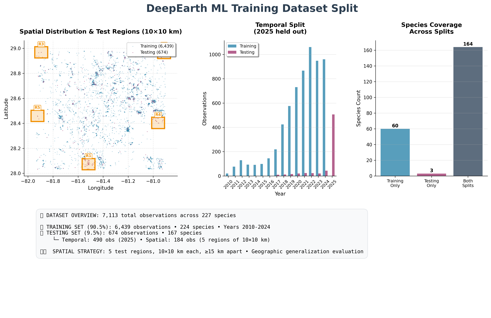
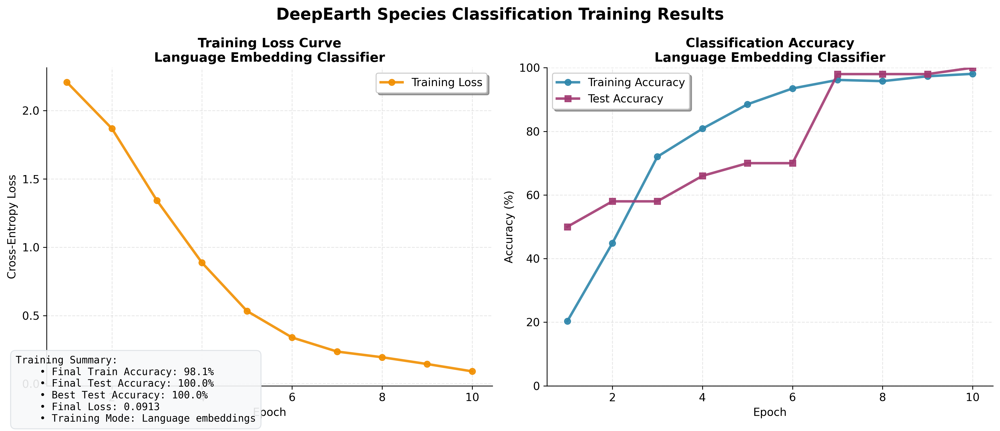
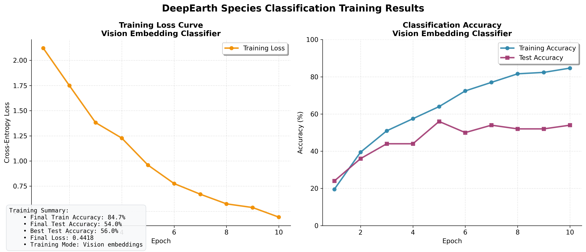

# DeepEarth Training Infrastructure

**Foundation Training Components for Multimodal Earth System Modeling**


## Overview

The DeepEarth Training Infrastructure provides foundational components and reference implementations for developing machine learning models on multimodal earth system data. This system includes skeleton training scripts, dataset splitting utilities, and performance benchmarking tools designed to serve as starting points for building sophisticated spatiotemporal modeling architectures.

### Training Infrastructure Components

- **Reference Training Scripts**: Basic PyTorch implementations demonstrating data pipeline integration
- **Spatiotemporal Dataset Splitting**: Geographic and temporal split generation with scientific rigor  
- **Performance Benchmarking**: Data loading optimization and timing analysis
- **Multimodal Data Pipeline**: High-performance batch loading for vision and language embeddings

### Architecture Foundation

The system establishes patterns for the broader DeepEarth project:
- **Spatiotemporal Data Handling**: Geographic and temporal boundaries for robust model evaluation
- **Memory-Mapped Access**: Efficient data loading with <50ms batch times for large earth system datasets
- **Modular Design**: Service-oriented architecture enabling research extension and integration
- **Multimodal Integration**: Foundation for V-JEPA-2 + DeepSeek-V3 + Grid4D fusion architectures

## Quick Start

**Prerequisites**: Complete the [DeepEarth Dashboard setup](../dashboard/README.md) first to download and index the dataset.

### 1. Verify Dashboard Setup

Ensure you have completed the dashboard setup:

```bash
cd /path/to/deepearth/dashboard

# This should already be done - downloads ~206GB dataset and creates ML-ready indices
python3 prepare_embeddings.py --download deepearth/central-florida-native-plants

# Verify dashboard works
python3 deepearth_dashboard.py
```

### 2. Generate Dataset Split

```bash
cd /path/to/deepearth/dashboard
python3 ../training/scripts/create_train_test_split.py
```

**Creates scientifically rigorous splits:**
- **Training**: 2010-2024 observations (6,439 obs, 90.5%)
- **Testing**: 2025 + 5 spatial regions (674 obs, 9.5%)
- **Spatial Strategy**: 10×10 km regions, ≥15 km apart

### 3. Train Reference Models

```bash
cd /path/to/deepearth/training

# Language classifier (DeepSeek-V3 embeddings)
python3 train_classifier.py --mode language --epochs 10 --batch-size 32

# Vision classifier (V-JEPA-2 embeddings)  
python3 train_classifier.py --mode vision --epochs 10 --batch-size 16
```

### 4. Benchmark Performance

```bash
# Test data loading performance
python3 scripts/benchmark_data_access.py --batch-size 64 --runs 10

# Expected: <50ms per batch for direct import
```

## Dataset Architecture

### Spatiotemporal Split Strategy



The training infrastructure implements a scientifically rigorous split strategy designed to test both **geographic** and **temporal generalization** for earth system models:

#### Temporal Split
- **Training**: All observations from 2010-2024 (15 years)
- **Testing**: All 2025 observations (temporal holdout)
- **Rationale**: Tests model's ability to generalize to future time periods

#### Spatial Split  
- **Training**: Central Florida minus 5 test regions
- **Testing**: 5 carefully selected 10×10 km regions
- **Selection Criteria**: 
  - Minimum 15 km separation between regions
  - Representative species distribution
  - Strategic geographic coverage

**Split Statistics:**
```
📊 Dataset: 7,113 observations across 227 species
🚂 Training: 6,439 observations (90.5%) • 224 species  
🎯 Testing: 674 observations (9.5%) • 167 species
   └─ Temporal: 490 obs (2025) • Spatial: 184 obs (5 regions)
```

### OBSERVATION_ID Schema

Training data uses `"{gbif_id}_{image_index}"` format (e.g., `"4171912265_1"`). Utility functions in `services.training_data` handle ID creation and parsing.

## Training Data Pipeline

### High-Performance Batch Loading

```python
from services.training_data import get_training_batch

batch_data = get_training_batch(
    cache, observation_ids, include_vision=True, include_language=True, device='cuda'
)
# Returns PyTorch-ready tensors: species, locations, timestamps, embeddings
```

**Performance**: ~15ms per observation for batch loading, optimal at 64+ batch sizes.

## Model Architectures

### Language Classifier (Reference Implementation)

```python
class LanguageClassifier(nn.Module):
    """
    Reference implementation: DeepSeek-V3 Language Embeddings → Species Classification
    
    Architecture: 7168D → 128 → 128 → num_species
    Note: This is a skeleton implementation for demonstration purposes
    """
    
    def __init__(self, num_classes: int, embedding_dim: int = 7168, hidden_dim: int = 128):
        super().__init__()
        
        self.classifier = nn.Sequential(
            nn.Linear(embedding_dim, hidden_dim),
            nn.ReLU(),
            nn.Dropout(0.2),
            nn.Linear(hidden_dim, hidden_dim), 
            nn.ReLU(),
            nn.Dropout(0.2),
            nn.Linear(hidden_dim, num_classes)
        )
```

**Training Results:**


This reference implementation demonstrates data pipeline integration and provides a baseline for more sophisticated architectures. The language classifier achieves high accuracy on the filtered dataset, though this result is not particularly meaningful given the overlap between training and test species.

### Vision Classifier (Reference Implementation)

```python
class VisionClassifier(nn.Module):
    """
    Reference implementation: V-JEPA-2 Vision Embeddings → Species Classification
    
    Architecture: (8×24×24×1408) → Global Mean Pool → MLP → num_species  
    Note: This is a skeleton implementation for demonstration purposes
    """
    
    def __init__(self, num_classes: int, hidden_dim: int = 128):
        super().__init__()
        
        # Vision embeddings: temporal×height×width×features
        # Global average pooling → 1408D feature vector
        
        self.classifier = nn.Sequential(
            nn.Linear(1408, hidden_dim),
            nn.ReLU(),
            nn.Dropout(0.3),
            nn.Linear(hidden_dim, hidden_dim),
            nn.ReLU(), 
            nn.Dropout(0.3),
            nn.Linear(hidden_dim, num_classes)
        )
        
    def forward(self, vision_embeddings):
        # Global average pooling across spatial and temporal dimensions
        x = vision_embeddings.mean(dim=(1, 2, 3))  # (batch, 8, 24, 24, 1408) → (batch, 1408)
        return self.classifier(x)
```

**Training Results:**


This reference implementation demonstrates the data pipeline for vision embeddings. The training curves show expected learning patterns and provide a baseline for developing more sophisticated architectures.

### Architecture Design Notes

These reference classifiers use simple MLP architectures for:

1. **Demonstration Purposes**: Show integration patterns with the data pipeline
2. **Baseline Establishment**: Provide starting points for research development
3. **Computational Efficiency**: Enable rapid iteration during development
4. **Pipeline Validation**: Verify data loading and training infrastructure

## Training System Components

### 📁 Directory Structure

```
training/
├── train_classifier.py              # 🎯 Main training script (583 lines)
├── config/
│   └── central_florida_split.json   # 📋 Train/test split configuration
├── scripts/
│   ├── create_train_test_split.py    # 🗺️ Dataset splitting with visualization (542 lines)
│   └── benchmark_data_access.py      # ⚡ Performance benchmarking (449 lines)
├── docs/
│   ├── training_curves_*.png         # 📊 Training visualizations
│   └── train_test_split_visualization.png # 🗺️ Dataset split analysis
└── models/                           # 💾 Saved model checkpoints
    ├── deepearth_language_classifier_*.pth
    └── deepearth_vision_classifier_*.pth
```

### 🎯 Core Training Script (`train_classifier.py`)

**Key Features:**
- **DeepEarthDataset**: Custom PyTorch Dataset class for multimodal data
- **Elegant Visualization**: Matplotlib-based training curves with professional styling
- **Model Persistence**: Comprehensive checkpoint saving with metadata
- **Memory Management**: Efficient GPU memory usage patterns
- **Progress Tracking**: Real-time training progress with performance metrics

**Training Loop Architecture:**
```python
# Training pipeline
train_ids, test_ids = load_train_test_split("config/central_florida_split.json")
dataset = DeepEarthDataset(train_ids, cache, mode='language', device='cuda')
model = LanguageClassifier(dataset.num_classes).cuda()

for epoch in range(epochs):
    train_loss, train_acc = train_epoch(model, train_loader, criterion, optimizer)
    test_loss, test_acc = evaluate_model(model, test_loader, criterion)
    # Automatic visualization generation
```

### Dataset Split Generator (`create_train_test_split.py`)

Generates spatiotemporal dataset splits using geodesic distance calculations and temporal stratification. Most users will use the pre-generated split configuration.

### Performance Benchmarking (`benchmark_data_access.py`)

Tests data loading performance between direct Python import vs Flask API access. Direct import achieves ~15ms per observation.

## Advanced Usage

### 🔧 Custom Training Loops

```python
from training.train_classifier import DeepEarthDataset, LanguageClassifier
from torch.utils.data import DataLoader
import torch.nn.functional as F

# Load configuration
with open("config/central_florida_split.json", 'r') as f:
    config = json.load(f)

# Extract observation IDs
train_ids = [obs_id for obs_id, meta in config['observation_mappings'].items() 
             if meta['split'] == 'train']

# Create dataset with custom parameters
dataset = DeepEarthDataset(
    observation_ids=train_ids[:1000],  # Subset for experimentation
    cache=cache,
    mode='language',
    device='cuda',
    species_mapping=custom_species_mapping  # Consistent label mapping
)

# Custom training with advanced optimizers
model = LanguageClassifier(dataset.num_classes).cuda()
optimizer = torch.optim.AdamW(model.parameters(), lr=0.001, weight_decay=0.01)
scheduler = torch.optim.lr_scheduler.CosineAnnealingLR(optimizer, T_max=100)

# Training with gradient accumulation
accumulation_steps = 4
for batch_idx, batch in enumerate(dataloader):
    outputs = model(batch['language_embedding'])
    loss = F.cross_entropy(outputs, batch['species_label']) / accumulation_steps
    loss.backward()
    
    if (batch_idx + 1) % accumulation_steps == 0:
        optimizer.step()
        optimizer.zero_grad()
        scheduler.step()
```

### Multimodal Research Directions

The training infrastructure supports development of advanced multimodal architectures for earth system modeling, following the DeepEarth foundation model approach of learning unified representations through masked reconstruction.

**Self-Supervised Multimodal Masked Autoencoding**
- Cross-modal reconstruction: predict masked vision features from language embeddings and vice versa
- Spatiotemporal context integration: leverage Grid4D coordinate encoding for earth system modeling
- Modality-agnostic learning: foundation for integrating arbitrary earth observation data types
- Pathway toward full DeepEarth transformer architecture with hierarchical cross-modal fusion

```python
class MultimodalMaskedAutoencoder(nn.Module):
    """
    Self-supervised cross-modal reconstruction for earth system modeling
    
    Inspired by DeepEarth's approach: learn by predicting one modality from another,
    enabling the model to discover deep relationships between vision and language
    representations of ecological phenomena.
    """
    
    def __init__(self, vision_dim: int = 1408, language_dim: int = 7168, fusion_dim: int = 512):
        super().__init__()
        
        # Modality encoders: project to shared representation space
        self.vision_encoder = nn.Sequential(
            nn.Linear(vision_dim, fusion_dim),
            nn.LayerNorm(fusion_dim),
            nn.ReLU()
        )
        self.language_encoder = nn.Sequential(
            nn.Linear(language_dim, fusion_dim), 
            nn.LayerNorm(fusion_dim),
            nn.ReLU()
        )
        
        # Cross-modal prediction heads
        self.vision_predictor = nn.Linear(fusion_dim, vision_dim)
        self.language_predictor = nn.Linear(fusion_dim, language_dim)
        
    def forward(self, vision_emb, language_emb, vision_mask=None, language_mask=None):
        """
        Cross-modal reconstruction training:
        - Encode each modality to shared space
        - Predict masked modality from unmasked modality
        - Learn unified earth system representations
        """
        # Encode to shared representation space
        vision_shared = self.vision_encoder(vision_emb)
        language_shared = self.language_encoder(language_emb)
        
        # Cross-modal prediction: use one modality to reconstruct the other
        vision_recon = self.vision_predictor(language_shared)  # Language → Vision
        language_recon = self.language_predictor(vision_shared)  # Vision → Language
        
        # Apply masks during training to force cross-modal learning
        if vision_mask is not None:
            vision_recon = vision_recon * vision_mask.unsqueeze(-1)
        if language_mask is not None:
            language_recon = language_recon * language_mask.unsqueeze(-1)
            
        return {
            'vision_reconstruction': vision_recon,
            'language_reconstruction': language_recon,
            'shared_vision': vision_shared,
            'shared_language': language_shared
        }
```

